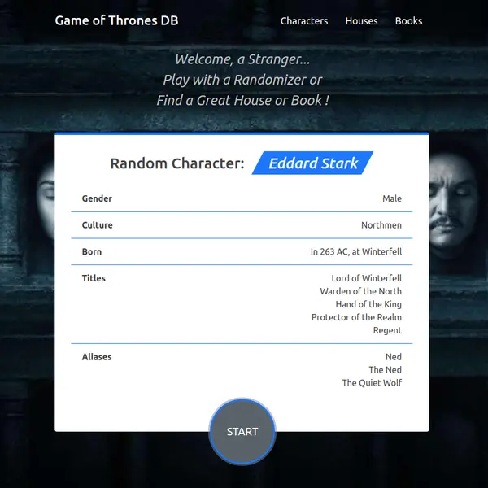

# React-GOT-app

> React training-project from udemy course

## Preview

[Link | React-GOT-app on Netlify](https://filgeary-react-got-app.netlify.app/)

## What I've learned

- Fetch API, Adapter
- Spinner, Error Message components
- Component Lifecycle
- Basic React patterns
- Basic React Router
- PropTypes & default Props
- Basic Hooks: useState, useEffect

## Next step

- add tests & TypeScript

## TODO

- add images for Houses, Books
- add Favorites List
- add game rules ??
